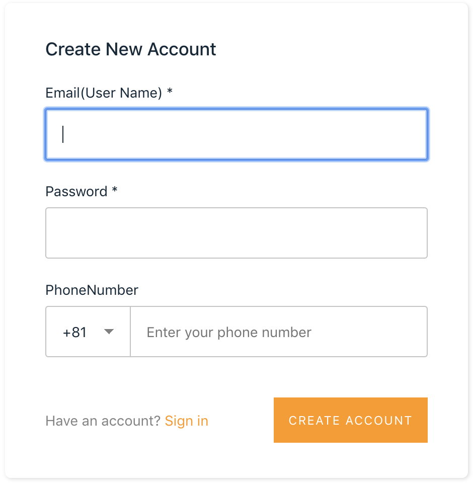
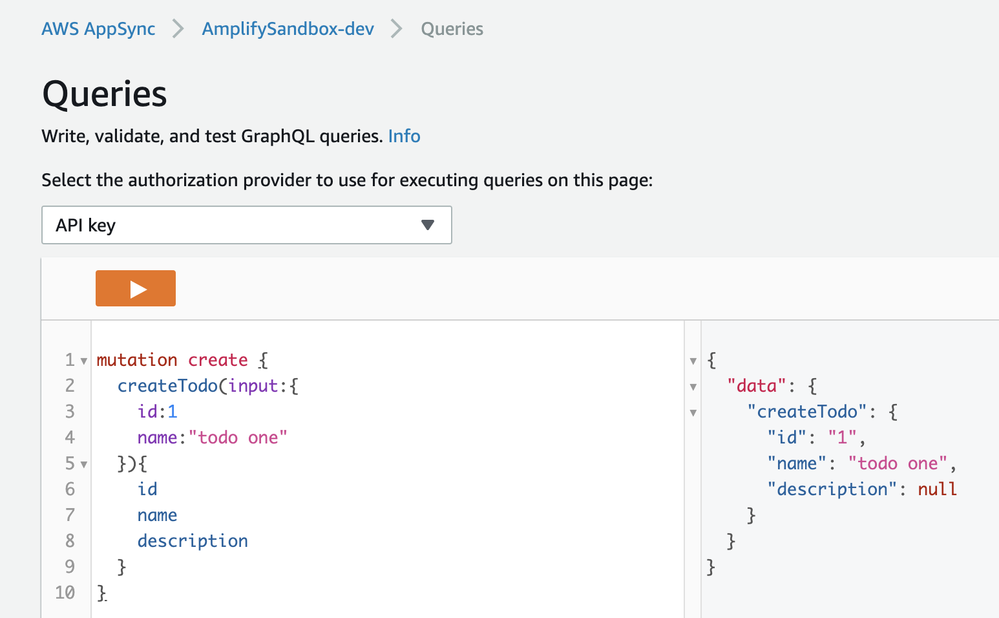
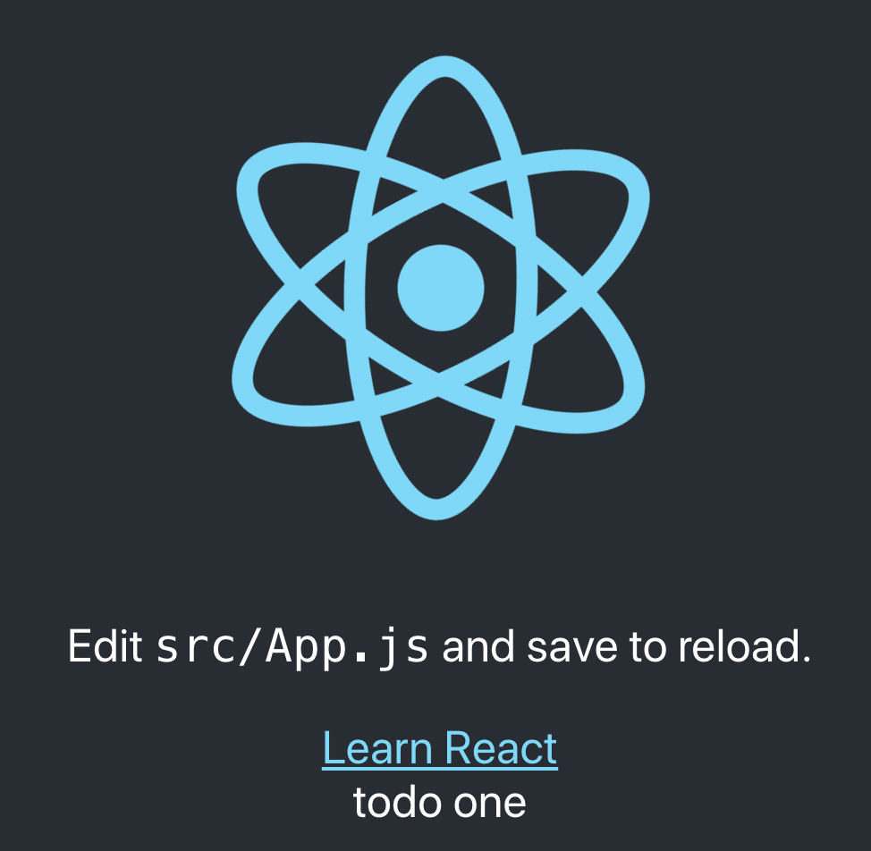

# Amplify × React App 構築メモ

[公式チュートリアル(React)](https://aws-amplify.github.io/docs/js/start?platform=react)を参考に構築する。

## React Settings

React のテンプレートを使用して構築を行う。

```bash
# テンプレートを使用するためにインストール
yarn global add create-react-app
# Reactアプリのテンプレートを使用
create-react-app myapp && cd myapp
# 実行してみる
yarn start
```

## Amplify Settings

先に CLI のインストールを行う。

```bash
yarn global add @aws-amplify/cli
```

次に、必要なパッケージをインストール

```bash
yarn add aws-amplify
# 以下はUIコンポーネント
yarn add aws-amplify-react
```

Amplify CLI を使用してプロジェクトのセットアップを行う

以下のリンクが参考になりそう。  
<https://aws-amplify.github.io/docs/cli-toolchain/quickstart#environments--teams>

```bash
amplify init
```

※初めて構築する場合、途中で AWS へのログインを求められます。  
事前に AWS アカウントの作成を行ってください。

| メッセージ                                  | 設定値               |
| :------------------------------------------ | :------------------- |
| Enter a name for the project                | プロジェクト名       |
| Enter a name for the environment            | dev                  |
| Choose your default editor                  | Visual Studio Code   |
| Choose the type of app that you're building | javascript           |
| What javascript framework are you using     | react                |
| Source Directory Path                       | src                  |
| Distribution Directory Path                 | build                |
| Build Command                               | npm run-script build |
| Start Command                               | npm run-script start |
| Do you want to use an AWS profile?          | Y, default           |

成功すると以下のメッセージが表示される

```none
✔ Successfully created initial AWS cloud resources for deployments.
✔ Initialized provider successfully.
Initialized your environment successfully.

Your project has been successfully initialized and connected to the cloud!
```

上記の作業だけで以下の内容がセットアップされる。

- IAM
- S3
- CloudFormation

IAM が自動生成される  


S3 が自動生成される  


CloudFormation はテンプレートが作成される
`team-provider-info.json`

### init 後の作業

コンソールには以下の内容が出力されている。

> **Some next steps:**  
> "amplify status" will show you what you've added already and if it's locally configured or deployed  
> "amplify \<category> add" will allow you to add features like user login or a backend API  
> "amplify push" will build all your local backend resources and provision it in the cloud  
> "amplify publish" will build all your local backend and frontend resources (if you have hosting category added) and provision it in the cloud
>
> **Pro tip:**  
> Try "amplify add api" to create a backend API and then "amplify publish" to deploy everything

`amplify status`で現在の状態を確認

```bash
$ amplify status

Current Environment: dev

| Category | Resource name | Operation | Provider plugin |
| -------- | ------------- | --------- | --------------- |
```

`amplify add <category-name>`で追加したいバックエンドリソースを指定する。

■ バックエンドリソース一覧

- analytics
- api
- auth
- function
- hosting
- interactions
- notifications
- storage

一番手軽な`hosting`から実行する。

```bash
$ amplify add hosting
# 選択内容は以下。今回は参考用のため、DEV(HTTP)を指定
? Select the environment setup: DEV (S3 only with HTTP)
? hosting bucket name amplify-sandbox-20190712161239-hostingbucket
? index doc for the website index.html
? error doc for the website index.html
# 完了後、publish実行
$ amplify publish
```

publish 完了後、自動でブラウザが立ち上がる  


ホスティング後のステータスを確認

```bash
$ amplify status

Current Environment: dev

| Category | Resource name   | Operation | Provider plugin   |
| -------- | --------------- | --------- | ----------------- |
| Hosting  | S3AndCloudFront | No Change | awscloudformation |

Hosting endpoint: http://amplify-sandbox-20190712161239-hostingbucket-dev.s3-website-us-east-1.amazonaws.com
```

---

## HTTPS でのホスティング

仕切り直して HTTPS で再構築

ちなみに、HTTP は S3 バケットを使用、HTTPS は S3 バケット+Cloud Front を使用する

```bash
# ホスティング設定をCLIから削除
$ amplify remove hosting
# HTTPSで再構築
$ amplify add hosting
? Select the environment setup: PROD (S3 with CloudFront using HTTPS)
? hosting bucket name amplify-sandbox-20190712172010-hostingbucket
? index doc for the website index.html
? error doc for the website index.html
# publishする前にS3バケットの中身を削除すること！！
# 削除しないとエラーになる
$ amplify publish
# 成功すると以下の内容が表示される
frontend build command exited with code 0
✔ Uploaded files successfully.
Your app is published successfully.
https://d2x1vl85jldz43.cloudfront.net
```

ステータス確認

```bash
$ amplify status

Current Environment: dev

| Category | Resource name   | Operation | Provider plugin   |
| -------- | --------------- | --------- | ----------------- |
| Hosting  | S3AndCloudFront | No Change | awscloudformation |

Hosting endpoint: https://d2x1vl85jldz43.cloudfront.net
```

---

## 認証機能の追加

以下を参考に構築  
<https://aws-amplify.github.io/docs/js/authentication>

### 認証方式

認証は以下の２つから選べる

- [Amazon Cognito User Pools](https://docs.aws.amazon.com/ja_jp/cognito/latest/developerguide/cognito-user-identity-pools.html)
- [Amazon Cognito Federated Identities](https://docs.aws.amazon.com/ja_jp/cognito/latest/developerguide/cognito-identity.html)

[User Pools]

> Amazon Cognito ユーザープールを使用して、独自のディレクトリをすばやく作成し、  
> ユーザーにサインアップおよびサインインしたり、ユーザープロファイルを保存したりできます。

こちらはユーザープールを使用して認証を行う機能。  
Google、Facebook、Amazon などのソーシャル ID プロバイダー、SAML ベースの ID プロバイダー経由でユーザープールにサインインすることも可能。


[Federated Identities]

> アプリのユーザーが適切なアクセス権のみを取得するように、Amazon Cognito を使用してバックエンドの AWS リソースおよび  
> API へのアクセスを制御することができます。

こちらは他サービスで認証し、AWS リソースに一時的にアクセス出来るようにする機能。  
ID プールを使用し、他の認証サービスと連携が可能。

- パブリックプロバイダー: Login with Amazon (ID プール)、Facebook (ID プール)、Google (ID プール)
- Amazon Cognito ユーザープール
- Open ID Connect プロバイダー (ID プール)
- SAML ID プロバイダー (ID プール)
- 開発者が認証した ID (ID プール)

SNS 認証を行いたい場合は以下が参考になりそう。  
<https://dev.to/dabit3/the-complete-guide-to-user-authentication-with-the-amplify-framework-2inh>

### 追加手順

以下のコマンドを実行し、認証機能を追加

```bash
amplify add auth
```

オプションは以下から選択可能。

- Default configuration：User Pools のみ使用
- Default configuration with Social Provider (Federation)：User Pools と SNS 認証を使用
- Manual configuration：手動設定。自身で AWS リソース設定を行う必要がある

今回は`Default configuration`を選択、認証には Email を使用。

上記完了後、以下のコマンドを実行

```bash
amplify push
amplify publish
```

### ソース修正

`src/App.js`を修正する。

```diff
+import Amplify from 'aws-amplify';
+import awsconfig from './aws-exports';
+import { withAuthenticator } from 'aws-amplify-react';
import React from 'react';
import logo from './logo.svg';
import './App.css';

+Amplify.configure(awsconfig);

function App() {
// 省略
}

-export default App;
+export default withAuthenticator(App, true);
```

たったこれだけで認証ページが追加される。


### サインアップ設定

デフォルト設定の場合、ユーザー名、パスワード、Email、電話番号の設定を求められる。  
登録する項目を変更したい場合は別途設定が必要。

■ サインアップ設定項目

| 項目名             | 説明                                                     |
| :----------------- | :------------------------------------------------------- |
| header             | サインアップ画面のヘッダ文言を設定                       |
| signUpFields       | サインアップ画面に表示する項目を設定(配列)               |
| defaultCountryCode | 電話番号の国コードの初期値を設定                         |
| hideAllDefaults    | 全てのデフォルト入力項目を表示するかを設定(true/false)   |
| hiddenDefaults     | 特定のデフォルト入力項目を非表示にしたい場合に設定(配列) |

■signUpFields の設定項目

| 項目名       | 説明                                                   |
| :----------- | :----------------------------------------------------- |
| label        | 入力項目のラベル                                       |
| key          | User Pool と紐付く項目名 ※1                            |
| required     | 必須有無(true/false)                                   |
| displayOrder | 画面表示順(数値)                                       |
| type         | HTML の input type(string, number, password 等)        |
| custom       | ユーザープールの項目がカスタム項目かの有無(true/false) |

[※1 ユーザープールの属性](https://docs.aws.amazon.com/ja_jp/cognito/latest/developerguide/user-pool-settings-attributes.html)

上記の設定をオブジェクト(JSON)で定義し、追加する。

```javascript
const signUpConfig = {
  // 省略
};

export default withAuthenticator(App, { signUpConfig });
```



## API(GraphQL)の追加

```bash
$ amplify add api
? Please select from one of the below mentioned services GraphQL
? Provide API name: amplifySandbox
? Choose an authorization type for the API API key
? Do you have an annotated GraphQL schema? No
? Do you want a guided schema creation? Yes
? What best describes your project: Single object with fields (e.g., “Todo” with ID, name, description)
? Do you want to edit the schema now? Yes
Please edit the file in your editor: /Users/iwakura/Program/Js/amplify-sandbox/amplify/backend/api/amplifySandbox/schema.graphql
? Press enter to continue

GraphQL schema compiled successfully.
Edit your schema at /Users/iwakura/Program/Js/amplify-sandbox/amplify/backend/api/amplifySandbox/schema.graphql or place .graphql files in a directory at /Users/iwakura/Program/Js/amplify-sandbox/amplify/backend/api/amplifySandbox/schema
Successfully added resource amplifySandbox locally

Some next steps:
"amplify push" will build all your local backend resources and provision it in the cloud
"amplify publish" will build all your local backend and frontend resources (if you have hosting category added) and provision it in the cloud
```

TODO の情報が記載された「schema.graphql」ファイルが作成される。

### ソース修正

```diff
-import Amplify from 'aws-amplify';
+import Amplify, { API, graphqlOperation } from 'aws-amplify';
import awsconfig from './aws-exports';
import { withAuthenticator } from 'aws-amplify-react';
-import React from 'react';
+import React, { useState, useEffect } from 'react';
import logo from './logo.svg';
import './App.css';

Amplify.configure(awsconfig);

+const ListTodos = `
+query list {
+  listTodos {
+    items {
+      id name
+    }
+  }
+}
+`;
+
function App() {
+  const [stateTodos, setTodos] = useState([]);
+  useEffect(() => {
+    (async () => {
+      const todos = await API.graphql(graphqlOperation(ListTodos));
+      setTodos(todos.data.ListTodos.items);
+    })();
+  }, []);
+
  return (
    <div className="App">
      <header className="App-header">
        // 省略
+        {
+          stateTodos.map(todo => (
+            <div id={todo.id} key={todo.id}>
+              {todo.name}
+            </div>
+          ))}
      </header>
    </div>
  );
```

### コマンド実行

```bash
$ amplify push

Current Environment: dev

| Category | Resource name          | Operation | Provider plugin   |
| -------- | ---------------------- | --------- | ----------------- |
| Api      | amplifySandbox         | Create    | awscloudformation |
| Hosting  | S3AndCloudFront        | No Change | awscloudformation |
| Auth     | amplifysandboxc1d009ba | No Change | awscloudformation |
? Are you sure you want to continue? Yes

GraphQL schema compiled successfully.
Edit your schema at /Users/iwakura/Program/Js/amplify-sandbox/amplify/backend/api/amplifySandbox/schema.graphql or place .graphql files in a directory at /Users/iwakura/Program/Js/amplify-sandbox/amplify/backend/api/amplifySandbox/schema
? Do you want to generate code for your newly created GraphQL API Yes
? Choose the code generation language target javascript
? Enter the file name pattern of graphql queries, mutations and subscriptions src/graphql
/**/*.js
? Do you want to generate/update all possible GraphQL operations - queries, mutations and
 subscriptions Yes
? Enter maximum statement depth [increase from default if your schema is deeply nested] 2


⠏ Updating resources in the cloud. This may take a few minutes...

# 省略

✔ Generated GraphQL operations successfully and saved at src/graphql
✔ All resources are updated in the cloud

GraphQL endpoint: <URL>
GraphQL API KEY: <APIキー>
```



publishして画面を表示


