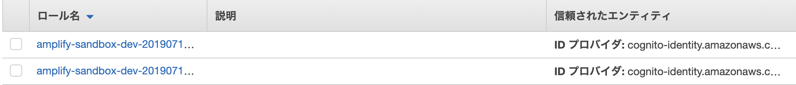

# Amplify × React App 構築メモ

[公式チュートリアル(React)](https://aws-amplify.github.io/docs/js/start?platform=react)を参考に構築する。

## React Settings

Reactのテンプレートを使用して構築を行う。

```bash
# テンプレートを使用するためにインストール
yarn global add create-react-app
# Reactアプリのテンプレートを使用
create-react-app myapp && cd myapp
# 実行してみる
yarn start
```

## Amplify Settings

先にCLIのインストールを行う。

```bash
yarn global add @aws-amplify/cli
```

次に、必要なパッケージをインストール

```bash
yarn add aws-amplify
# 以下はUIコンポーネント
yarn add aws-amplify-react
```

Amplify CLIを使用してプロジェクトのセットアップを行う

以下のリンクが参考になりそう。  
<https://aws-amplify.github.io/docs/cli-toolchain/quickstart#environments--teams>

```bash
amplify init
```

※初めて構築する場合、途中でAWSへのログインを求められます。  
事前にAWSアカウントの作成を行ってください。

|メッセージ|設定値|
|:--|:--|
|Enter a name for the project|プロジェクト名|
|Enter a name for the environment|dev|
|Choose your default editor|Visual Studio Code|
|Choose the type of app that you're building|javascript|
|What javascript framework are you using|react|
|Source Directory Path|src|
|Distribution Directory Path|build|
|Build Command|npm run-script build|
|Start Command|npm run-script start|
|Do you want to use an AWS profile?|Y, default|

成功すると以下のメッセージが表示される

```none
✔ Successfully created initial AWS cloud resources for deployments.
✔ Initialized provider successfully.
Initialized your environment successfully.

Your project has been successfully initialized and connected to the cloud!
```

上記の作業だけで以下の内容がセットアップされる。

- IAM
- S3
- CloudFormation

IAMが自動生成される  


S3が自動生成される  


CloudFormationはテンプレートが作成される
`team-provider-info.json`

### init後の作業

コンソールには以下の内容が出力されている。

>**Some next steps:**  
>"amplify status" will show you what you've added already and if it's locally configured or deployed  
>"amplify \<category> add" will allow you to add features like user login or a backend API  
>"amplify push" will build all your local backend resources and provision it in the cloud  
>"amplify publish" will build all your local backend and frontend resources (if you have hosting category added) and provision it in the cloud  
>
>**Pro tip:**  
>Try "amplify add api" to create a backend API and then "amplify publish" to deploy everything  

`amplify status`で現在の状態を確認

```bash
$ amplify status

Current Environment: dev

| Category | Resource name | Operation | Provider plugin |
| -------- | ------------- | --------- | --------------- |
```

`amplify add <category-name>`で追加したいバックエンドリソースを指定する。  

■バックエンドリソース一覧

- analytics
- api
- auth
- function
- hosting
- interactions
- notifications
- storage

一番手軽な`hosting`から実行する。

```bash
$ amplify add hosting
# 選択内容は以下。今回は参考用のため、DEV(HTTP)を指定
? Select the environment setup: DEV (S3 only with HTTP)
? hosting bucket name amplify-sandbox-20190712161239-hostingbucket
? index doc for the website index.html
? error doc for the website index.html
# 完了後、publish実行
$ amplify publish
```

publish完了後、自動でブラウザが立ち上がる  


ホスティング後のステータスを確認

```bash
$ amplify status

Current Environment: dev

| Category | Resource name   | Operation | Provider plugin   |
| -------- | --------------- | --------- | ----------------- |
| Hosting  | S3AndCloudFront | No Change | awscloudformation |

Hosting endpoint: http://amplify-sandbox-20190712161239-hostingbucket-dev.s3-website-us-east-1.amazonaws.com
```

---

## HTTPSでのホスティング

仕切り直してHTTPSで再構築

ちなみに、HTTPはS3バケットを使用、HTTPSはS3バケット+Cloud Frontを使用する

```bash
# ホスティング設定をCLIから削除
$ amplify remove hosting
# HTTPSで再構築
$ amplify add hosting
? Select the environment setup: PROD (S3 with CloudFront using HTTPS)
? hosting bucket name amplify-sandbox-20190712172010-hostingbucket
? index doc for the website index.html
? error doc for the website index.html
# publishする前にS3バケットの中身を削除すること！！
# 削除しないとエラーになる
$ amplify publish
# 成功すると以下の内容が表示される
frontend build command exited with code 0
✔ Uploaded files successfully.
Your app is published successfully.
https://d2x1vl85jldz43.cloudfront.net
```

ステータス確認

```bash
$ amplify status

Current Environment: dev

| Category | Resource name   | Operation | Provider plugin   |
| -------- | --------------- | --------- | ----------------- |
| Hosting  | S3AndCloudFront | No Change | awscloudformation |

Hosting endpoint: https://d2x1vl85jldz43.cloudfront.net
```

---

## 認証機能の追加

以下を参考に構築  
<https://aws-amplify.github.io/docs/js/authentication>

### 認証方式

認証は以下の２つから選べる

- [Amazon Cognito User Pools](https://docs.aws.amazon.com/ja_jp/cognito/latest/developerguide/cognito-user-identity-pools.html)
- [Amazon Cognito Federated Identities](https://docs.aws.amazon.com/ja_jp/cognito/latest/developerguide/cognito-identity.html)

[User Pools]  
>Amazon Cognito ユーザープールを使用して、独自のディレクトリをすばやく作成し、  
>ユーザーにサインアップおよびサインインしたり、ユーザープロファイルを保存したりできます。

こちらはユーザープールを使用して認証を行う機能。  
Google、Facebook、AmazonなどのソーシャルIDプロバイダー、SAML ベースのIDプロバイダー経由でユーザープールにサインインすることも可能。


[Federated Identities]  
>アプリのユーザーが適切なアクセス権のみを取得するように、Amazon Cognito を使用してバックエンドの AWS リソースおよび  
>API へのアクセスを制御することができます。

こちらは他サービスで認証し、AWSリソースに一時的にアクセス出来るようにする機能。  
IDプールを使用し、他の認証サービスと連携が可能。

- パブリックプロバイダー: Login with Amazon (ID プール)、Facebook (ID プール)、Google (ID プール)
- Amazon Cognito ユーザープール
- Open ID Connect プロバイダー (ID プール)
- SAML ID プロバイダー (ID プール)
- 開発者が認証した ID (ID プール)

SNS認証を行いたい場合は以下が参考になりそう。  
<https://dev.to/dabit3/the-complete-guide-to-user-authentication-with-the-amplify-framework-2inh>

### 追加手順

以下のコマンドを実行し、認証機能を追加

```bash
amplify add auth
```

オプションは以下から選択可能。

- Default configuration：User Poolsのみ使用
- Default configuration with Social Provider (Federation)：User PoolsとSNS認証を使用
- Manual configuration：手動設定。自身でAWSリソース設定を行う必要がある

今回は`Default configuration`を選択、認証にはEmailを使用。

上記完了後、以下のコマンドを実行

```bash
amplify push
amplify publish
```

### ソース修正

`src/App.js`を修正する。

```diff
+import Amplify from 'aws-amplify';
+import awsconfig from './aws-exports';
+import { withAuthenticator } from 'aws-amplify-react';
import React from 'react';
import logo from './logo.svg';
import './App.css';

+Amplify.configure(awsconfig);

function App() {
// 省略
}

-export default App;
+export default withAuthenticator(App, true);
```

たったこれだけで認証ページが追加される。


### サインアップ設定

デフォルト設定の場合、ユーザー名、パスワード、Email、電話番号の設定を求められる。  
登録する項目を変更したい場合は別途設定が必要。

■サインアップ設定項目

|項目名|説明|
|:--|:--|
|header|サインアップ画面のヘッダ文言を設定|
|signUpFields|サインアップ画面に表示する項目を設定(配列)|
|defaultCountryCode|電話番号の国コードの初期値を設定|
|hideAllDefaults|全てのデフォルト入力項目を表示するかを設定(true/false)|
|hiddenDefaults|特定のデフォルト入力項目を非表示にしたい場合に設定(配列)|

■signUpFieldsの設定項目

|項目名|説明|
|:--|:--|
|label|入力項目のラベル|
|key|User Poolと紐付く項目名 ※1|
|required|必須有無(true/false)|
|displayOrder|画面表示順(数値)|
|type|HTMLのinput type(string, number, password等)|
|custom|ユーザープールの項目がカスタム項目かの有無(true/false)|

[※1 ユーザープールの属性](https://docs.aws.amazon.com/ja_jp/cognito/latest/developerguide/user-pool-settings-attributes.html)

上記の設定をオブジェクト(JSON)で定義し、追加する。

```javascript
const signUpConfig = {
  // 省略
};

export default withAuthenticator(App, { signUpConfig });
```


